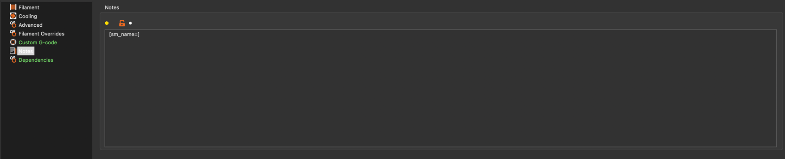

# Filament-Nozzle Post-Processor
This is a post-processor for the gcode generated by the slicer. It is written in Python but an executable is also 
available for Windows and MacOS and (Linux have a version pf python3 installed by default). 

The post-processor is used to easily add the necessary spool data into the gcode if you don't want to have a different 
profile for each spool of filament you have, but still want to use the spool checking feature available in the plugin.

## Slicer Config

Using this requires the slicer to be set up correctly.
The post-processor will look for the following settings in the notes section of the filament profile in the gcode
<code>[sm_name=]</code> if this is not present the post-processor will not let you edit the gcode and if in post-processor mode,
will simply export the gcode as is.
(Note: you cannot have brackets [] in the name of your filament.)

Image of the settings in Prusa slicer:


## Usage

### Windows

### You may need to whitelist the exe in your antivirus software, because I use pyinstaller to create the exe, it may be flagged as a false positive.
#### if you are paranoid about running the exe, you can either build it from source (instructions coming soon) or use the python script.

Download the postprocessor.zip file found in the release.
Unzip the folder and double click the <code>setup-postprocessor-exe.bat</code> file if you are going to run use the provided exe or 
<code>setup-postprocessor-python.bat</code> if you plan on running the python code.

Copy the output and paste it into the post processor part of the slicer settings (found under print settings/output options in Prusa slicer).

From now on, use the output command to  edit the spool settings(editing the spool names to include in the gcode).
(coming soon for windows: automatic start menu support)

When exporting the gcode, a window will pop up asking you to confirm the current settings. 
If you are happy with the settings, click ok, otherwise edit the spools until they are correct.

### Mac and Linux
*We will need the terminal for this, I promise it isn't too bad, and you will be guided through it*

First download the postprocessor.zip file found in the release. 

Unzip the folder and navigate to the folder in the terminal 

- For gnome, open the folder in nautilus and right-click and select open in terminal.
- For mac, open the folder one level below the folder and right-click the folder and select new terminal at folder.
- Alternatively, open the terminal and use cd to get to the directory 

Then run the Following command: <code>sh setup_postprocessor-macos.sh</code> For macOS.
if you are using python, run <code>sh setup_postprocessor-python.sh</code> instead.

Copy the output and paste it into the post-processor part of the slicer settings
(found under print settings/output options in Prusa slicer).

For Mac users, we are all done with the terminal now.

From now on, use the output command to  edit the spool settings (editing the spool names to include in the gcode).
(Coming soon for macOS: automatic launchpad support)
(If using linux, I will assume you know how to make a desktop shortcut or add it to the application menu)

(there is no executable for linux since there are so many different distros and desktop environments, but the python script should work just fine)

When exporting the gcode, a window will pop up asking you to confirm the current settings. 
If you are happy with the settings, click ok, otherwise edit the spools until they are correct.

## Building from source
The original Python implementation lives in `implementations/python`.
The Rust implementation lives in `implementations/rust`.

To build and install the Rust app, install Rust from <https://rustup.rs/> and run:

```sh
python3 implementations/rust/setup.py
```

The Rust setup script builds a release binary and installs it for the current platform:

- Linux: installs the binary in `~/.local/bin`, creates a `.desktop` file, and prints the slicer post-processor command.
- macOS: creates an app bundle in `/Applications` when writable, otherwise `~/Applications`, and prints the slicer post-processor command.
- Windows: installs the exe and support files under `%LOCALAPPDATA%` and prints the slicer post-processor command.

To build without installing, run:

```sh
python3 implementations/rust/setup.py --build-only
```

To build the legacy Python app, run the platform build script in `implementations/python`.
